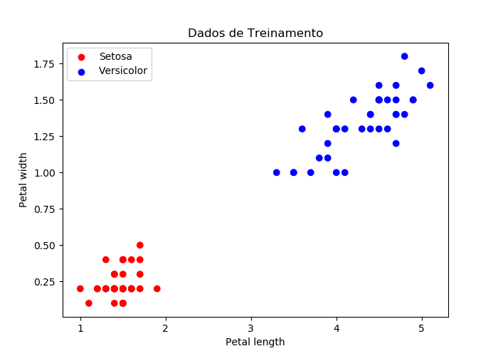
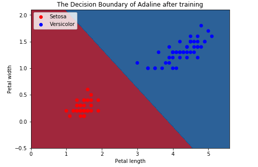
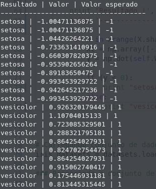

# Adaline Python: Uma aplicação no problema da _Iris_

## O Problema da _Iris_

- _Iris_ é um conjunto de dados real ([clique aqui](https://en.wikipedia.org/wiki/Iris_flower_data_set) para visualizar). Consiste em um problema clássico problema do ramo da inteligência computacional.
    - Deseja-se identificar que tipo de flor você tem com base em medições distintas, como o comprimento e a largura da pétala.
    - O conjunto de dados (que, inclusive, está contido na biblioteca `sklearn` do Python) inclui três tipos de flores. Eles são todos espécies de _Iris_: _setosa_, _vesicolor_ e _virginica_.
    - Existem 50 exemplos por tipo, logo, existem 150 no total.
    - Existem 4 características para descrever cada exemplo: comprimento e largura da sépala, e comprimento e largura da pétala.

## Objetivos do Código

- Implementar o Adaline na linguagem Python.
- Importar o conjunto de dados da _iris_ (do Python) para treinar o algoritmo do Adaline, previamente implementado. O treinamento deve ser feito com apenas 40 dados de apenas dois tipos de _iris_ e com apenas duas de suas características (a largura e o comprimento da pétala).
- Por fim, testar o Adaline com os 10 dados restantes os dois tipo de _iris_.

## Requisitos

- Ter o Python, versão 2.7, instalado.
- Instalar as bibliotecas `numpy`, `matplotlib`, `scipy` e `sklearn`. Para isso, digite os seguintes comandos no _cmd_ ou no _Terminal_:
    > `pip install numpy matplolib scipy sklearn`

## Resultados

